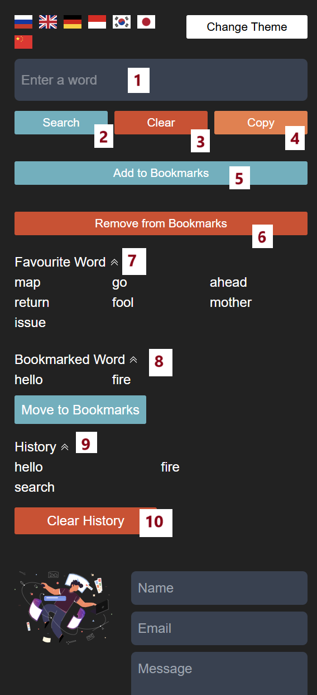
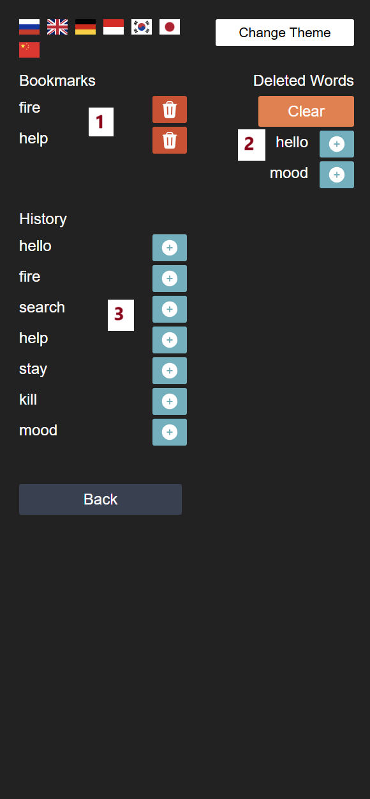

<a id="anchor"></a>

# Online English Words Library 
The web application is an online dictionary:

the user enters a word or expression (in English) in the search field and receives detailed information:
* part of speech, 
* transcription, 
* audio, 
* examples with searched word, 
* synonyms, etc.

There is also a search history, a feedback form and bookmarks (you can add or remove the words you need). + the application supports _Russian, English, German, Korean, Japanese and Chinese._

***

The project is written due to __Vite__ + __ReactJS__ + __Redux Toolkit__ + __TypeScript__ + __TailwindCSS__

***

### Page structure:

1. Main
  1.1 NavBar
  1.2 Main Content
  1.3 Contact
  1.4 Footer
2. Bookmarks
3. Not Found

***

### Instruction:
* Main Page



1. The field for writing a needed word
2. Search button (after clicking user gets response from api)
3. Clear the field
4. Copy entered word
5. Add entered word to Bookmarks
6. Remove entered word to Bookmarks
7. List of favourite words (_point 5_)
8. List of bookmarked words (_point 6_)
9. User's search history
10. Clear all History
(also user has an opportunity to send email to developer :))

* Bookmarks Page



1. List of user's current Bookmarks (user can delete each item)
2. Deleted Words (user can add them to Bookmarks again)
3. User's words history (user also can add words to Bookmark)

Feature 
: User cannot add word to Bookmarks if current word is already in the list. Below is the example from __reducer__

Code
```
const removeDublicates = (array: string[]):string[] => {
    return [...new Set(array)]
}

interface IFavourites {
    favourites: Array<string>
}

const initialState: IFavourites = {
    favourites: removeDublicates(JSON.parse(localStorage.getItem('favouriteWords') || '[]'))
}

const favouritesSlice = createSlice({
    name: 'favourites',
    initialState,
    reducers: {
        addFavouriteWord(state, action: PayloadAction<string>) {
            state.favourites.push(action.payload.toLowerCase());
            state.favourites = removeDublicates(state.favourites);
            localStorage.setItem('favouriteWords', JSON.stringify(state.favourites));
        },
        removeFavouriteWord(state, action: PayloadAction<number>) {
            state.favourites.splice(action.payload, 1);
            localStorage.setItem('favouriteWords', JSON.stringify(state.favourites));
        }
    },
});
```

[Up](#anchor)